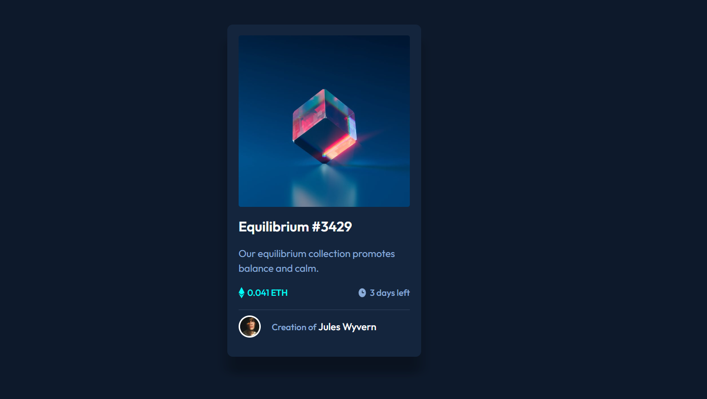

# Make It Real - NFT-PREVIEW-CARD-COMPONENT-MAIN

This is a solution to the NFT PREVIEW CARD project of the Make It Real course.

- You can view HTML page here - [NFT PREVIEW CARD](https://punobootcamper.github.io/ntf-preview-card-component/)

## Table of contents

- [Overview](#overview)
  - [The challenge](#the-challenge)
  - [Screenshot](#screenshot)
- [My process](#my-process)
  - [Built with](#built-with)
  - [What I learned](#what-i-learned)
  - [Continued development](#continued-development)
  - [Useful resources](#useful-resources)
- [Author](#author)
- [Acknowledgments](#acknowledgments)


## Overview

### The challenge

Users should be able to:

- Create a responsive team page using Flexbox.
- Align and distribute team member blocks.
- Display NFT card and author.
- Make the design responsive for both desktop and mobile views.
- Ensure proper use of CSS properties like margin, padding, and box-sizing.

### Screenshot




## My process

### Built with

- Semantic HTML5 markup
- CSS custom properties
- Flexbox for layout
- Responsive design (mobile-first workflow)
- CSS variables

### What I learned

While working on this project, I learned how to use Hover and after. Additionally, I learned how to use variables in CSS to reuse them in the design. Here is an example of variables in CSS.

```css
:root {
    --primary-soft-blue: hsl(215, 51%, 70%);
    --primary-cian:hsl(178, 100%, 50%);
    --neutral-very-dark-blue-main-bg: hsl(217, 54%, 11%);
    --neutral-very-dark-blue-card-bg: hsl(216, 50%, 16%);
    --neutral-very-dark-blue-line: hsl(215, 32%, 27%);
    --neutral-white: hsl(0, 0%, 100%);
}
```

If you want more help with writing markdown, we'd recommend checking out [The Markdown Guide](https://www.markdownguide.org/) to learn more.

### Continued development

In future projects, I plan to continue refining my knowledge of Flexbox and CSS variables to better handle layouts. I also plan to explore more responsive design techniques to ensure that my designs are accessible on a wide range of devices.

### Useful resources

- [Conceptos básicos de flexbox](https://developer.mozilla.org/es/docs/Web/CSS/CSS_flexible_box_layout/Basic_concepts_of_flexbox) - This helped me to vertically sort the blocks.
- [:hover CSS](https://developer.mozilla.org/es/docs/Web/CSS/:hover) - It helped me to add interaction.
- [::after CSS](https://developer.mozilla.org/en-US/docs/Web/CSS/::after) - It helped me to add interaction.

## Author

- Github - [william lupaca](https://github.com/PunoBootcamper)


## Acknowledgments

Thanks to the Make It Real course for providing this challenge and the helpful resources that guided me throughout the process.
